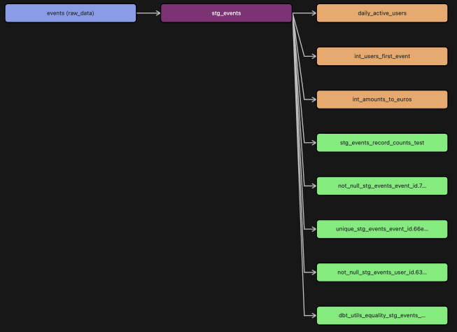
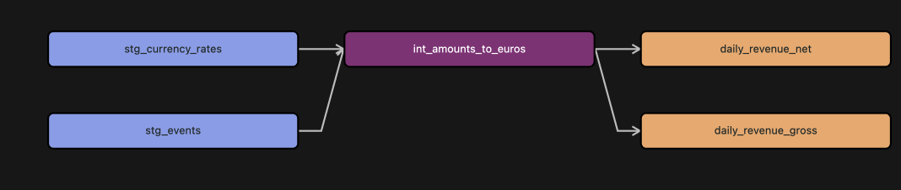
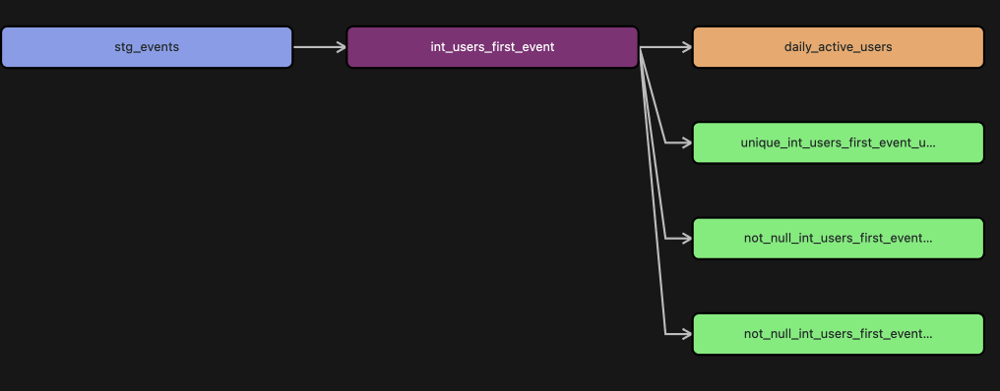
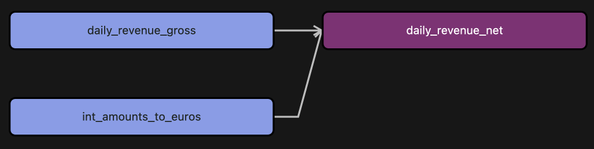
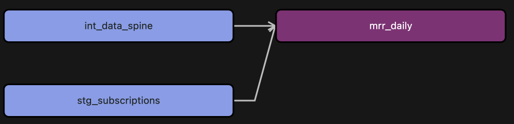
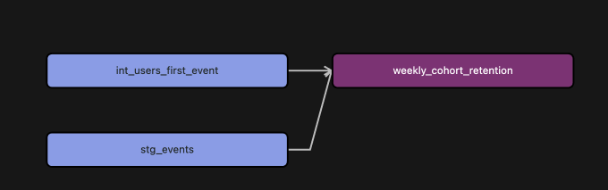
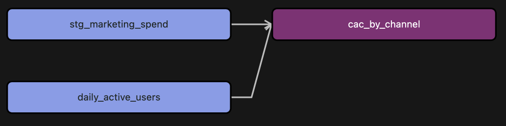
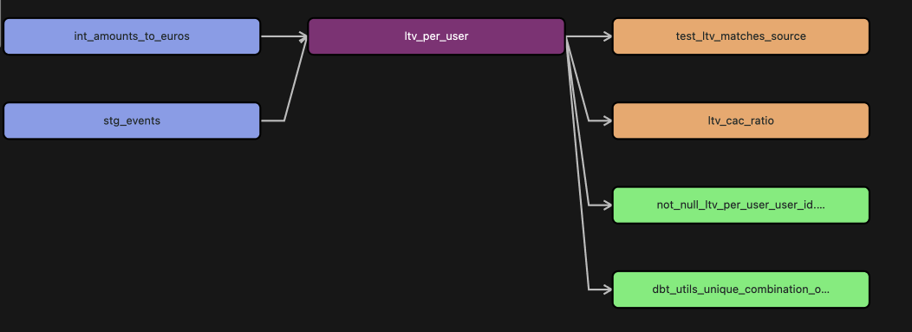
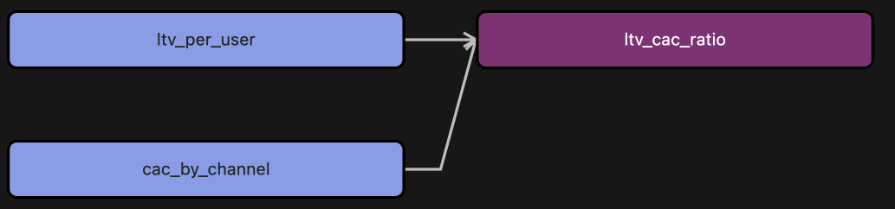

# Audicin_assignment

The stack I used in this assignment is dbt + Databricks + AWS S3. The code is orgnized to medallion layers, which orgnized as bronze (raw_data), silver (stg_data + int_data), gold (marts). All the code is under `my_dbt` directory, all the dbt related commands should be run in the `my_dbt` directory.         
**Bronze/Silver/Gold layers (or equivalent) and why**               
Medallion layers is classic data architecture pattern, which separate the raw data, cleaned data, and metrics, making each layer can be rebuilt independently if errors occur. The incremental processing reduces computational load and provides strong scalability.           

**Storage format choices (e.g., Parquet/Iceberg/Delta; or DuckDB/SQLite; or warehouse tables)**          
Since the data is stored in Databricks, I used delta format for all the tables.        
**Partitioning/clustering strategy**         
Partitioning is used to divide the data into smaller partitions based on the date, which improves the query performance. For specific patition keys in each table, see the table schema in the following sections.           
**Incremental strategy (how you avoid full refreshes)**        
In this assignment, incremental strategy is used to avoid full refreshes. To fetch new data, I always set the specific date window (start date to start date + interval).        
**Idempotency strategy (how re‑runs and partial failures behave)**      
In this assignment, tables are incremental models with merge strategy, unique keys prevent duplicate records, and backfills are safe, merging oversrites only relevant rows. Table `ltv_per_user` is cumulative metrics, it adds new revenue to the previous LTV without duplicating values.        
**How you handle schema evolution + timestamp normalization**         
Based on the medallion architecture with incremental models, the models are defined with unique keys, so new columns can be added without rewriting the full table. For updating the full history, backfilling is needed.       
**How you handle corrupted rows (quarantine strategy)**          
For the corrupted rows, the incremental models + full refresh can easily handle the corrupted rows. Therefore, there is no need to quarantine the corrupted rows.         
**Backfill strategy (how you rebuild historical data correctly)**         
For backfilling, I set up the varibales `start_date` and `interval`, and use the `--vars` option to specify the date window. For example, to backfill the data from 2026-01-01 to 2026-02-01, use the following command:

```
dbt run --select table_name --vars '{"start_date": "2026-01-01", "interval": 40}'
```

## Bronze Layer
This layer is the raw data from the datasets and is stored in the bronze schema in Databricks with delta format. The datasets used for this assignment include `events.ndjson`, `subscriptions.json`, `marketing_spend.csv`, and `exchange_rates.csv`. `exchange_rates.csv` file is not included in the given data, I searched it online to get the currency exchange rates of USD and NGN to EUR from 2026-01-01 to 2026-02-01, which is the time period of the events data. 

Since `dbt seed` can only load csv files from the dbt repo into Databricks, `marketing_spend.csv` and `exchange_rates.csv` are loaded using `dbt seed --select marketing_spend exchange_rates`. Loading `events.ndjson` into Databricks using following command:

```
create table events_json
using json
location 's3://audicin-assignment/bronze/events.ndjson';
```
Then convert the json format into delta format using following command:

```
CREATE OR REPLACE TABLE bronze.events
USING delta
AS
SELECT * FROM bronze.events_json;
```
Keep the json format that every query scans raw files, and it slows down the query performance, so I converted the json format into delta format.

The `subscriptions.json` is loaded using Databricks UI.


## Silver Layer
The silver layer includes the cleaned data from the bronze layer and the helper tables for the downstream models. All the tables are structured incrementally and partitioned by date, which avoids the full refresh for each execution. Normal daily runs use incremental models to process only new or updated data, avoiding unnecessary full scans.


### stg_events:
A cleaned version of the raw events data, with some basic data quality checks and transformations. I removed bad values, and nulls in event_id and user_id, added the event_date column. If the channel is null, I set it to 'unknown', that enables for the downstream models to calculate the CAC by channel.
#### Data Lineage:


**source table**: events
**partition_key**: event_date

In this table, the `event_id` is unique and not null, `user_id` is not null. The `acquisition_channel` is set to 'unknown' if it is null. 

**columns**:
|column|type|description|
|---|---|---|
|event_id|string|The unique identifier of the event.|
|user_id|string|The unique identifier of the user.|
|refers_to_event_id|string|The unique identifier of the event that this event refers to.|
|acquisition_channel|string|The acquisition channel of the user.|
|event_type|string|The type of the event.|
|page|string|The page of the event.|
|schema_version|string|The schema version of the event.|
|amount|double|The amount of the event.|
|currency|string|The currency of the event.|
|tax|double|The tax of the event.|
|o_ts|timestamp|The timestamp of the event.|
|event_date|date|The date of the event.|
|amount|double|The amount of the event.|
|currency|string|The currency of the event.|
|tax|double|The tax of the event.|
|o_ts|timestamp|The timestamp of the event.|
|event_date|date|The date of the event.|


### stg_subscripitions:
This table is the cleaned version of the raw subscriptions data, with some basic data quality checks and transformations. 
**source table**: subscriptions
**partition_key**: event_date

**columns**:
|column|type|description|
|---|---|---|
|subscription_id|string|The unique identifier of the subscription.| 
|user_id|string|The unique identifier of the user.| 
|plan_id|string|The unique identifier of the plan.| 
|price|double|The price of the subscription.| 
|currency|string|The currency of the subscription.| 
|start_date|date|The start date of the subscription.| 
|created_at|timestamp|The timestamp of the subscription.| 
|created_date|date|The date of the subscription.| 
|end_date|date|The end date of the subscription.| 
|event_date|date|The date when the data is updated.| 


### stg_marketing_spend:
This is a cleaned version of the raw marketing spend data, with some basic data quality checks and transformations. I removed the null values in spend_date and channel, added the spend_date column.
**source table**: marketing_spend
**partition_key**: spend_date

columns:
|column|type|description|
|---|---|---|
|spend_date|date|The date of the spend.|
|channel|string|The channel of the spend.|
|spend|double|The amount of the spend.|

Backfilling:
using command 
```
dbt run --select stg_marketing_spend --vars '{"start_time": "2026-01-01", "interval": 40}'
```

### int_amounts_to_euros:
This table is a helper table to convert the amounts and tax in different currencies to euros. It is used to calculate the daily gross revenue and net revenue.
#### Data Lineage:


**source tables**: stg_events, stg_currency_rates
**partition_key**: event_date

columns:
|column|type|description|
|---|---|---|
|event_id|string|The unique identifier of the event.|
|user_id|string|The unique identifier of the user.|
|amount|double|The amount of the event.|
|tax|double|The tax of the event.|
|currency|string|The currency of the event.|
|event_type|string|The type of the event.|
|o_ts|timestamp|The timestamp of the event.|
|event_date|date|The date of the event.|
|rate|double|The exchange rate of the currency.|
|amount_in_euros|double|The amount of the event in euros.|
|tax_in_euros|double|The tax of the event in euros.|


### int_users_first_event
This is a helper table for daily_active_users, which stores the first event date for each user.

#### Data Lineage and Quality Checks:


**source_table**: stg_events

**columns**:
|column|type|description|
|---|---|---|
|user_id|string|The unique identifier of the user.|
|first_event_date|date|The date of the first event.|

### int_data_spine
This is a helper table for `mrr_daily` table, while only contains the active calendar dates.

**columns**:
|column|type|description|
|---|---|---|
|date_day|date|The date of the event.| 


## Gold Layer
### daily_active_users
This table is a daily active users table, one row per user per day. 
**source_table**: stg_events, int_users_first_event
**partition_key**: event_date

**columns**:
|column|type|description|
|---|---|---|
|user_id|string|The unique identifier of the user.| 
|event_date|date|The date of the event.|


### daily_revenue_gross
This table is a daily gross revenue table, one row per day, which is the sum of all purchase amount in euros.
#### Data Lineage and Quality Checks:


**source_table**: int_amounts_to_euros
**partition_key**: event_date

**columns**:
|column|type|description|
|---|---|---|
|event_date|date|The date of the event.| 
|gross_revenue|double|The gross revenue of the event.| 


### daily_revenue_net
This table is a daily net revenue table, one row per day, which is the sum of all purchase amount (reduced by taxes) in euros minus the sum of all refund amount in euros.
#### Data Lineage and Quality Checks:


**source_table**: int_amounts_to_euros, daily_revenue_gross
**partition_key**: event_date

**columns**:
|column|type|description|
|---|---|---|
|event_date|date|The date of the event.| 
|net_revenue|double|The net revenue of the event.| 

Backfilling:
using command 
```
dbt run --select daily_revenue_net --vars '{"start_time": "2026-01-01", "interval": 40}'
```

### mrr_daily
This table is a daily MRR table, one row per subscription per active day. An active day is defined as any calendar date when a subscription should contribute to revenue. This table I created more like a raw MRR ledger, since the dataset here is quite small, it includes more details about the subscription and can be used to calculate other metrics.
#### Data Lineage and Quality Checks:


**source_table**: int_data_spine, stg_subscriptions
**partition_key**: event_date

**columns**:
|column|type|description|
|---|---|---|
|event_date|date|The date of the event.| 
|mrr|double|The MRR of the event.| 


### weekly_cohort_retention
This talbe calculates weekly retention rates for user cohorts based on their signup week. It's useful for understanding how many users return over the first several weeks after signing up, enabling insights into user engagement. The table is incrementally built and partitioned by `cohort_week`. Retention is calculated as `retained users / cohort size`.

#### Data Lineage and Quality Checks:


**source_table**: stg_events, int_users_first_event
**partition_key**: cohort_week

**columns**:
|column|type|description|
|---|---|---|
|cohort_week|date|The date of the cohort.| 
|week_0|double|The number of retained users in week 0.| 
|week_1|double|The number of retained users in week 1.| 
|week_2|double|The number of retained users in week 2.| 
|week_3|double|The number of retained users in week 3.| 
|week_4|double|The number of retained users in week 4.| 


### cac_by_channel
This table is a daily CAC by channel table, one row per day, which is the sum of all marketing spend in euros divided by the number of new users in that day.
#### Data Lineage and Quality Checks:


The accuracy of this cac is tested by dbt expression test, that the accuracy of cac is within 0.0001.

**source_table**: stg_marketing_spend, daily_active_users
**partition_key**: event_date

**columns**:
|column|type|description|
|---|---|---|
|event_date|date|The date of the event.| 
|channel|string|The channel of the event.| 
|new_user_count|int|The number of new users in that day.| 
|spend|double|The sum of all marketing spend in euros in that day.| 
|cac|double|The CAC by channel of the event.| 


### ltv_per_user
This table is a daily snapshot table that tracks the cumulative LTV per user. The LTV is calculated as the sum of net revenue for a user from signup until event_date. This table built in a daily incremental merge strategy. For a given start_date, `LTV(D) = LTV(D-1) + new revenue(D)`
#### Data Lineage and Quality Checks:


**source_table**: stg_events, int_users_first_event
**partition_key**: event_date

**columns**:
|column|type|description|
|---|---|---|
|user_id|string|The unique identifier of the user.| 
|event_date|date|The date of the event.| 
|channel|string|The channel of the event.| 
|is_new_user|int|Whether the user is a new user.| 


### ltv_cac_ratio
This table is a daily LTV/CAC ratio table, one row per day, which is the sum of all net revenue in euros divided by the sum of all marketing spend in euros.
#### Data Lineage and Quality Checks:


**source_table**: stg_events, int_users_first_event
**partition_key**: event_date

**columns**:
|column|type|description|
|---|---|---|
|user_id|string|The unique identifier of the user.| 
|event_date|date|The date of the event.| 
|channel|string|The channel of the event.| 
|is_new_user|int|Whether the user is a new user.| 


## How to run
### Prerequisites
Python 3.12
uv

### 1. Install Dependencies
```
uv sync
```
### 2. Configure dbt Profile
create a dbt profile at ~/.dbt/profiles.yml with the following content:
```
my_dbt:
  outputs:
    dev:
      catalog: <your_catalog>
      host: <your_host>
      http_path: <your_http_path>
      schema: <your_schema>
      threads: 1
      token: <your_token>
      type: databricks
  target: dev
```
### 3. Run the project
All the commands should be run in the `my_dbt` folder. Run everything using `dbt build` command, or run specific model using `dbt build --select <model_name>`. For backfilling, use `dbt build --select <model_name> --vars '{"start_time": "2026-01-01", "interval": 40}'`.

### 4. Run the tests
```
dbt test --select <model_name>
```


